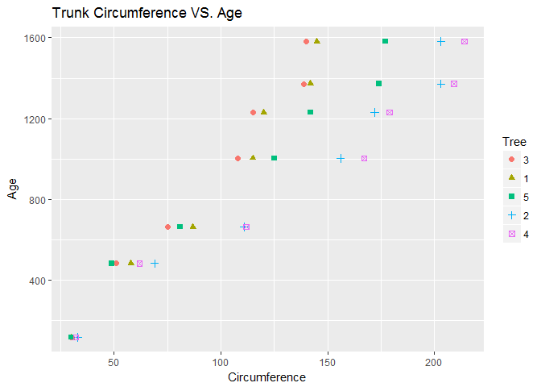

Case Study 2
================

Introduction
------------

Group B performed two analyses on the growth of orange trees and temperature based on different countries/cities. The orange tree analysis used the built-in data set called "Orange" in R while the temperature analysis used two data sets from box.com called "Temp" and "CityTemp". The different forms of comparisons and explorations are listed below based on the analysis.

Orange Tree data
----------------

The orange tree dataset is a built-in R dataset about the growth of orange trees. The Orange dataset called three variables: Tree (Ordered factor: 1:5), age (Numeric) and circumference (numeric). The trees were sorted per increasing maximum diameter. The age is given in the number of days since 1968/12/31. The circumferences (MM) are based on the tree's circumference at breast height. The statistical calculations and visualizations were created based of the variables listed above. Refer to the bullet points below for the types of calculations and visualizations performed and the conclusion for our findings.

-   Mean of the trunk circumferences for different size of the tree
-   Median of the trunk circumferences for different size of the tree
-   Scatter plot of the trunk circumferences against the age of the tree
-   Box plot of the trunk circumferences

``` r
# This file will download the data and store it as data frame variables.
source("sources/AnalyzeOrangeTreeData.R", echo = TRUE, keep.source = TRUE)
```

    ## 
    ## > # print dataset orange info
    ## > str(Orange)
    ## Classes 'nfnGroupedData', 'nfGroupedData', 'groupedData' and 'data.frame':   35 obs. of  3 variables:
    ##  $ Tree         : Ord.factor w/ 5 levels "3"<"1"<"5"<"2"<..: 2 2 2 2 2 2 2 4 4 4 ...
    ##  $ age          : num  118 484 664 1004 1231 ...
    ##  $ circumference: num  30 58 87 115 120 142 145 33 69 111 ...
    ##  - attr(*, "formula")=Class 'formula'  language circumference ~ age | Tree
    ##   .. ..- attr(*, ".Environment")=<environment: R_EmptyEnv> 
    ##  - attr(*, "labels")=List of 2
    ##   ..$ x: chr "Time since December 31, 1968"
    ##   ..$ y: chr "Trunk circumference"
    ##  - attr(*, "units")=List of 2
    ##   ..$ x: chr "(days)"
    ##   ..$ y: chr "(mm)"
    ## 
    ## > # calculate means for different tree sizes
    ## > circ_mean_tree_1 <- mean(Orange$circumference[1:7])
    ## 
    ## > circ_mean_tree_2 <- mean(Orange$circumference[8:14])
    ## 
    ## > circ_mean_tree_3 <- mean(Orange$circumference[15:21])
    ## 
    ## > circ_mean_tree_4 <- mean(Orange$circumference[22:28])
    ## 
    ## > circ_mean_tree_5 <- mean(Orange$circumference[29:35])
    ## 
    ## > # calculate medians for different tree sizes
    ## > circ_median_tree_1 <- median(Orange$circumference[1:7])
    ## 
    ## > circ_median_tree_2 <- median(Orange$circumference[8:14])
    ## 
    ## > circ_median_tree_3 <- median(Orange$circumference[15:21])
    ## 
    ## > circ_median_tree_4 <- median(Orange$circumference[22:28])
    ## 
    ## > circ_median_tree_5 <- median(Orange$circumference[29:35])

Plotting Orange Tree Data
-------------------------

We use a scatterplot and a comparative boxplot to view this data.

``` r
# This file will plot the information from the orange tree data analysis.
source("sources/PlotOrangeTreeData.R", echo = TRUE, keep.source = TRUE)
```

    ## 
    ## > # print scatter plot of trunk circumference vs age 
    ## > ggplot(Orange, aes(x=Orange$circumference, y=Orange$age, shape=Orange$Tree, color=Orange$Tree) .... [TRUNCATED]



    ## 
    ## > # print boxplot of trunk circumference vs age 
    ## > ggplot(Orange, aes(x=Orange$Tree, y=Orange$circumference, fill=Orange$Tree)) + 
    ## +   geom_boxplot()  .... [TRUNCATED]


Temperature Data
----------------

The "Temp" dataset had the following variables: Date(Date), Monthly AverageTemp (Numeric), Monthly AverageTemp Uncertainity (Numeric), and Country (Character). The other dataset, "CityTemp", had the following variables: Date (Data), Monthly AverageTemp (Numeric), Monthly AverageTemp Uncertainity (Numeric), City (Character), Country (Character), Latitude (Character), and Longitude (Character). The statistical calculations and visualizations were created based of the variables listed above. Refer to the bullet points below for the types of calculations and visualizations performed and the conclusion for our findings.

### First we need to clean the two datasets.

``` r
# This file will subset the data and clean it up.
source("sources/CleanTempDatasets.R", echo = TRUE, keep.source = TRUE)
```

    ## 
    ## > # Import Temp dataset and view the structure
    ## > Temperature <- read.csv("data/TEMP.csv", header = TRUE, sep = ',')
    ## 
    ## > str(Temperature)
    ## 'data.frame':    574223 obs. of  4 variables:
    ##  $ Date                           : Factor w/ 3239 levels "1/1/1900","1/1/1901",..: 1587 1588 1589 1590 1591 1592 1593 1594 1595 1596 ...
    ##  $ Monthly.AverageTemp            : num  13 NA 23.9 26.9 24.9 ...
    ##  $ Monthly.AverageTemp.Uncertainty: num  2.59 NA 2.51 2.88 2.99 ...
    ##  $ Country                        : Factor w/ 242 levels "Afghanistan",..: 1 1 1 1 1 1 1 1 1 1 ...
    ## 
    ## > head(Temperature)
    ##         Date Monthly.AverageTemp Monthly.AverageTemp.Uncertainty
    ## 1 1838-04-01              13.008                           2.586
    ## 2 1838-05-01                  NA                              NA
    ## 3 1838-06-01              23.950                           2.510
    ## 4 1838-07-01              26.877                           2.883
    ## 5 1838-08-01              24.938                           2.992
    ## 6 1838-09-01              18.981                           2.538
    ##       Country
    ## 1 Afghanistan
    ## 2 Afghanistan
    ## 3 Afghanistan
    ## 4 Afghanistan
    ## 5 Afghanistan
    ## 6 Afghanistan
    ## 
    ## > tail(Temperature)
    ##            Date Monthly.AverageTemp Monthly.AverageTemp.Uncertainty
    ## 574218 4/1/2013              21.142                           0.495
    ## 574219 5/1/2013              19.059                           1.022
    ## 574220 6/1/2013              17.613                           0.473
    ## 574221 7/1/2013              17.000                           0.453
    ## 574222 8/1/2013              19.759                           0.717
    ## 574223 9/1/2013                  NA                              NA
    ##         Country
    ## 574218 Zimbabwe
    ## 574219 Zimbabwe
    ## 574220 Zimbabwe
    ## 574221 Zimbabwe
    ## 574222 Zimbabwe
    ## 574223 Zimbabwe
    ## 
    ## > # The data has multiple date formats, so this will standardize them.
    ## > Temperature$Date2 <- parse_date_time(x = Temperature$Date, orders = c("y-m-d" .... [TRUNCATED] 
    ## 
    ## > # Import CityTemp dataset and view the structure
    ## > CityTemperature <- read.csv("data/CityTemp.csv", header = TRUE, sep = ',')
    ## 
    ## > str(CityTemperature)
    ## 'data.frame':    237200 obs. of  7 variables:
    ##  $ Date                           : Factor w/ 3239 levels "1/1/1900","1/1/1901",..: 1728 1729 1730 1731 1732 1733 1734 1735 1736 1737 ...
    ##  $ Monthly.AverageTemp            : num  16 18.3 18.6 18.2 17.5 ...
    ##  $ Monthly.AverageTemp.Uncertainty: num  1.54 1.53 2.16 1.69 1.24 ...
    ##  $ City                           : Factor w/ 99 levels "Addis Abeba",..: 1 1 1 1 1 1 1 1 1 1 ...
    ##  $ Country                        : Factor w/ 48 levels "Afghanistan",..: 14 14 14 14 14 14 14 14 14 14 ...
    ##  $ Latitude                       : Factor w/ 49 levels "0.80N","0.80S",..: 48 48 48 48 48 48 48 48 48 48 ...
    ##  $ Longitude                      : Factor w/ 92 levels "0.00W","103.66E",..: 48 48 48 48 48 48 48 48 48 48 ...
    ## 
    ## > head(CityTemperature)
    ##         Date Monthly.AverageTemp Monthly.AverageTemp.Uncertainty
    ## 1 1850-01-01              15.986                           1.537
    ## 2 1850-02-01              18.345                           1.527
    ## 3 1850-03-01              18.632                           2.162
    ## 4 1850-04-01              18.154                           1.693
    ## 5 1850-05-01              17.480                           1.237
    ## 6 1850-06-01              17.183                           1.252
    ##          City  Country Latitude Longitude
    ## 1 Addis Abeba Ethiopia    8.84N    38.11E
    ## 2 Addis Abeba Ethiopia    8.84N    38.11E
    ## 3 Addis Abeba Ethiopia    8.84N    38.11E
    ## 4 Addis Abeba Ethiopia    8.84N    38.11E
    ## 5 Addis Abeba Ethiopia    8.84N    38.11E
    ## 6 Addis Abeba Ethiopia    8.84N    38.11E
    ## 
    ## > tail(CityTemperature)
    ##            Date Monthly.AverageTemp Monthly.AverageTemp.Uncertainty City
    ## 237195 4/1/2013              12.563                           1.823 Xian
    ## 237196 5/1/2013              18.979                           0.807 Xian
    ## 237197 6/1/2013              23.522                           0.647 Xian
    ## 237198 7/1/2013              25.251                           1.042 Xian
    ## 237199 8/1/2013              24.528                           0.840 Xian
    ## 237200 9/1/2013                  NA                              NA Xian
    ##        Country Latitude Longitude
    ## 237195   China   34.56N   108.97E
    ## 237196   China   34.56N   108.97E
    ## 237197   China   34.56N   108.97E
    ## 237198   China   34.56N   108.97E
    ## 237199   China   34.56N   108.97E
    ## 237200   China   34.56N   108.97E
    ## 
    ## > # Just as with the previous dataset, we need to standardize the date formats.
    ## > CityTemperature$Date2 <- parse_date_time(x = CityTemperature$Date, o .... [TRUNCATED]

### Temp:

-   Difference: Between the maximum and minimum monthly average temperatures for each country
-   Visualize top 20 countries with the maximum differences for the period since 1900
-   Subset of data, "UStemp", where US land temperatures from 01/01/1900
    -   Created a new column in Fahrenheit (°F) of monthly average land temperatures
    -   Calculated the average land temperature by year
    -   Calculated the one year difference of average land temperature by year and maximum difference (value) with corresponding two years

``` r
# This file will subset the Temp dataset for analysis.
source("sources/SubsetTempData.R", echo = TRUE, keep.source = TRUE)
```

    ## 
    ## > # Subset Temperature to only get dates from 1900 and up
    ## > Temp <- subset(Temperature, Date2 >= "1900-01-01")
    ## 
    ## > str(Temp)
    ## 'data.frame':    328266 obs. of  5 variables:
    ##  $ Date                           : Factor w/ 3239 levels "1/1/1900","1/1/1901",..: 2328 2442 2556 2670 2784 2898 3012 3126 115 228 ...
    ##  $ Monthly.AverageTemp            : num  1.23 10.54 13.35 20.26 24.45 ...
    ##  $ Monthly.AverageTemp.Uncertainty: num  1.135 0.933 0.536 0.524 0.944 ...
    ##  $ Country                        : Factor w/ 242 levels "Afghanistan",..: 1 1 1 1 1 1 1 1 1 1 ...
    ##  $ Date2                          : POSIXct, format: "1900-02-01" "1900-03-01" ...
    ## 
    ## > # Create a dataset of the maximum temperatures by country
    ## > TempMax <- aggregate(Temp$Monthly.AverageTemp, by = list(Temp$Country), max, na.rm = TRU .... [TRUNCATED]

    ## Warning in FUN(X[[i]], ...): no non-missing arguments to max; returning -
    ## Inf

    ## 
    ## > colnames(TempMax) <- c("Country", "Maximum")
    ## 
    ## > str(TempMax)
    ## 'data.frame':    242 obs. of  2 variables:
    ##  $ Country: Factor w/ 242 levels "Afghanistan",..: 1 2 3 4 5 6 7 8 9 10 ...
    ##  $ Maximum: num  28.5 27.1 25.5 35.8 28.5 ...
    ## 
    ## > # Create a dataset of the minimum temperatures by country
    ## > TempMin <- aggregate(Temp$Monthly.AverageTemp, by = list(Temp$Country), min, na.rm = TRU .... [TRUNCATED]

    ## Warning in FUN(X[[i]], ...): no non-missing arguments to min; returning Inf

    ## 
    ## > colnames(TempMin) <- c("Country", "Minimum")
    ## 
    ## > str(TempMin)
    ## 'data.frame':    242 obs. of  2 variables:
    ##  $ Country: Factor w/ 242 levels "Afghanistan",..: 1 2 3 4 5 6 7 8 9 10 ...
    ##  $ Minimum: num  -4.55 19.79 -2.05 9.59 24.71 ...
    ## 
    ## > # Create a vector of only the max temperatures so that we don't have duplicate "Country" columns when the data is merged
    ## > TempMax2 <- TempMax$Maxim .... [TRUNCATED] 
    ## 
    ## > #Merge the data into a new combined dataset
    ## > TempDiff <- cbind(TempMin, TempMax2)
    ## 
    ## > colnames(TempDiff) <- c("Country", "Minimum", "Maximum")
    ## 
    ## > str(TempDiff)
    ## 'data.frame':    242 obs. of  3 variables:
    ##  $ Country: Factor w/ 242 levels "Afghanistan",..: 1 2 3 4 5 6 7 8 9 10 ...
    ##  $ Minimum: num  -4.55 19.79 -2.05 9.59 24.71 ...
    ##  $ Maximum: num  28.5 27.1 25.5 35.8 28.5 ...
    ## 
    ## > # Create a new variable of the difference between each country's minimum and maximum temperatures
    ## > TempDiff$Difference <- TempDiff$Maximum - TempDi .... [TRUNCATED] 
    ## 
    ## > # Order the dataset from greatest temperature difference to least
    ## > TempDiff <- TempDiff[order(TempDiff$Difference, decreasing = TRUE),]
    ## 
    ## > head(TempDiff)
    ##          Country Minimum Maximum Difference
    ## 116   Kazakhstan -23.601  25.562     49.163
    ## 145     Mongolia -27.294  20.716     48.010
    ## 181       Russia -29.789  16.893     46.682
    ## 41        Canada -28.736  14.796     43.532
    ## 235   Uzbekistan -12.323  30.375     42.698
    ## 226 Turkmenistan  -8.443  32.136     40.579
    ## 
    ## > # We also need to subset the Temp data by dates since 1990 and only US temperature measurements
    ## > Temp2 <- subset(Temperature, Date2 >= "1990-01-01" .... [TRUNCATED] 
    ## 
    ## > USTemp <- subset(Temp2, Country=="United States")
    ## 
    ## > str(USTemp)
    ## 'data.frame':    284 obs. of  5 variables:
    ##  $ Date                           : Factor w/ 3239 levels "1/1/1900","1/1/1901",..: 2418 2532 2646 2760 2874 2988 3102 3216 205 318 ...
    ##  $ Monthly.AverageTemp            : num  -1.75 4.46 9.38 13.77 19.78 ...
    ##  $ Monthly.AverageTemp.Uncertainty: num  0.107 0.24 0.08 0.112 0.255 0.175 0.218 0.203 0.159 0.3 ...
    ##  $ Country                        : Factor w/ 242 levels "Afghanistan",..: 233 233 233 233 233 233 233 233 233 233 ...
    ##  $ Date2                          : POSIXct, format: "1990-02-01" "1990-03-01" ...
    ## 
    ## > # Create a new variable converting the temperature readings from Celsius to Fahrenheit
    ## > USTemp$TempInF <- (USTemp$Monthly.AverageTemp * (9/5)) + 32
    ## 
    ## > head(USTemp)
    ##            Date Monthly.AverageTemp Monthly.AverageTemp.Uncertainty
    ## 554299 2/1/1990              -1.747                           0.107
    ## 554300 3/1/1990               4.465                           0.240
    ## 554301 4/1/1990               9.380                           0.080
    ## 554302 5/1/1990              13.772                           0.112
    ## 554303 6/1/1990              19.780                           0.255
    ## 554304 7/1/1990              21.605                           0.175
    ##              Country      Date2 TempInF
    ## 554299 United States 1990-02-01 28.8554
    ## 554300 United States 1990-03-01 40.0370
    ## 554301 United States 1990-04-01 48.8840
    ## 554302 United States 1990-05-01 56.7896
    ## 554303 United States 1990-06-01 67.6040
    ## 554304 United States 1990-07-01 70.8890
    ## 
    ## > # Retrieve just the year from each reading
    ## > USTemp$Year <- year(USTemp$Date2)
    ## 
    ## > tail(USTemp)
    ##            Date Monthly.AverageTemp Monthly.AverageTemp.Uncertainty
    ## 554577 4/1/2013               6.970                           0.221
    ## 554578 5/1/2013              14.073                           0.178
    ## 554579 6/1/2013              20.198                           0.236
    ## 554580 7/1/2013              22.074                           0.152
    ## 554581 8/1/2013              21.168                           0.249
    ## 554582 9/1/2013              18.273                           1.210
    ##              Country      Date2 TempInF Year
    ## 554577 United States 2013-04-01 44.5460 2013
    ## 554578 United States 2013-05-01 57.3314 2013
    ## 554579 United States 2013-06-01 68.3564 2013
    ## 554580 United States 2013-07-01 71.7332 2013
    ## 554581 United States 2013-08-01 70.1024 2013
    ## 554582 United States 2013-09-01 64.8914 2013
    ## 
    ## > # Create a dataset of the average temperature by year
    ## > USYearlyTemp <- aggregate(USTemp$TempInF, by = list(USTemp$Year), mean, na.rm = TRUE)
    ## 
    ## > str(USYearlyTemp)
    ## 'data.frame':    24 obs. of  2 variables:
    ##  $ Group.1: num  1990 1991 1992 1993 1994 ...
    ##  $ x      : num  50.9 49.1 48.3 48 48.7 ...
    ## 
    ## > colnames(USYearlyTemp) <- c("Year", "AverageTemp")

Plot of the Temp data
---------------------

We use a bar chart and line plot to analyze the differences in temperature for various countries.

``` r
# This file will analyze and plot the data.
source("sources/AnalyzeTempData.R", echo = TRUE, keep.source = TRUE)
```

    ## 
    ## > # Plot the differences in temperature by countries with the top monthly temperature differences
    ## > ggplot(TempDiff[1:20,], aes(x = Country, y = Diffe .... [TRUNCATED]


    ## 
    ## > # Plot the differences in annual average temperatures for the United States
    ## > ggplot(USYearlyTemp, aes(x = Year, y = AverageTemp)) + 
    ## +   geom_line( .... [TRUNCATED]

    ## 
    ## > # Create a variable of the difference in each yearly average temperature
    ## > USYearlyTemp$YearDiff <- as.numeric(c("NA", diff(USYearlyTemp$AverageTemp .... [TRUNCATED]

    ## Warning in eval(ei, envir): NAs introduced by coercion


    ## 
    ## > # Determine which year had the greatest temperature difference 
    ## > USYearlyTemp[which.max(USYearlyTemp$YearDiff),]
    ##    Year AverageTemp YearDiff
    ## 24 2013     52.3348  1.86485

### CityTemp:

-   Difference: Between the maximum and minimum temperature for each major city
-   Visualize the top cities with maximum difference for the period since 1900

``` r
# This file will subset the CityTemp dataset for analysis.
source("sources/SubsetCityTempData.R", echo = TRUE, keep.source = TRUE)
```

    ## 
    ## > # Subset the CityTemp dataset for all temperatures since 1900
    ## > CityTemp <- subset(CityTemperature, Date2 >= "1900-01-01")
    ## 
    ## > str(CityTemp)
    ## 'data.frame':    135036 obs. of  8 variables:
    ##  $ Date                           : Factor w/ 3239 levels "1/1/1900","1/1/1901",..: 2328 2442 2556 2670 2784 2898 3012 3126 115 228 ...
    ##  $ Monthly.AverageTemp            : num  18.2 19.1 19.5 18.4 17.6 ...
    ##  $ Monthly.AverageTemp.Uncertainty: num  0.772 0.954 0.887 2.247 0.948 ...
    ##  $ City                           : Factor w/ 99 levels "Addis Abeba",..: 1 1 1 1 1 1 1 1 1 1 ...
    ##  $ Country                        : Factor w/ 48 levels "Afghanistan",..: 14 14 14 14 14 14 14 14 14 14 ...
    ##  $ Latitude                       : Factor w/ 49 levels "0.80N","0.80S",..: 48 48 48 48 48 48 48 48 48 48 ...
    ##  $ Longitude                      : Factor w/ 92 levels "0.00W","103.66E",..: 48 48 48 48 48 48 48 48 48 48 ...
    ##  $ Date2                          : POSIXct, format: "1900-02-01" "1900-03-01" ...
    ## 
    ## > # Create a dataset of the maximum temperatures for each city
    ## > CityTempMax <- aggregate(CityTemp$Monthly.AverageTemp, by = list(CityTemp$City), max, .... [TRUNCATED] 
    ## 
    ## > colnames(CityTempMax) <- c("City", "Maximum")
    ## 
    ## > str(CityTempMax)
    ## 'data.frame':    99 obs. of  2 variables:
    ##  $ City   : Factor w/ 99 levels "Addis Abeba",..: 1 2 3 4 5 6 7 8 9 10 ...
    ##  $ Maximum: num  21.2 35.4 32.6 28.8 26 ...
    ## 
    ## > # Create a dataset of the minimum temperatures for each city
    ## > CityTempMin <- aggregate(CityTemp$Monthly.AverageTemp, by = list(CityTemp$City), min, .... [TRUNCATED] 
    ## 
    ## > colnames(CityTempMin) <- c("City", "Minimum")
    ## 
    ## > str(CityTempMin)
    ## 'data.frame':    99 obs. of  2 variables:
    ##  $ City   : Factor w/ 99 levels "Addis Abeba",..: 1 2 3 4 5 6 7 8 9 10 ...
    ##  $ Minimum: num  14.53 17.32 1.09 12.17 -6.2 ...
    ## 
    ## > # Create a vector of only the max temperatures so that we don't have duplicate "city" columns when the data is merged
    ## > CityTempMax2 <- CityTempMax$ .... [TRUNCATED] 
    ## 
    ## > # Merge the data into a new combined dataset
    ## > CityTempDiff <- cbind(CityTempMin, CityTempMax2)
    ## 
    ## > colnames(CityTempDiff) <- c("City", "Minimum", "Maximum")
    ## 
    ## > str(CityTempDiff)
    ## 'data.frame':    99 obs. of  3 variables:
    ##  $ City   : Factor w/ 99 levels "Addis Abeba",..: 1 2 3 4 5 6 7 8 9 10 ...
    ##  $ Minimum: num  14.53 17.32 1.09 12.17 -6.2 ...
    ##  $ Maximum: num  21.2 35.4 32.6 28.8 26 ...
    ## 
    ## > # Create a variable of the difference between each city's maximum and minimum temperatures
    ## > CityTempDiff$Difference <- CityTempDiff$Maximum - CityT .... [TRUNCATED] 
    ## 
    ## > # Order the data by the max differences for each city
    ## > CityTempDiff <- CityTempDiff[order(CityTempDiff$Difference, decreasing = TRUE),]
    ## 
    ## > head(CityTempDiff)
    ##         City Minimum Maximum Difference
    ## 34    Harbin -26.772  26.509     53.281
    ## 19 Changchun -23.272  26.572     49.844
    ## 65    Moscow -19.376  24.580     43.956
    ## 86  Shenyang -17.035  26.010     43.045
    ## 64  Montreal -18.363  23.059     41.422
    ## 48      Kiev -16.191  24.593     40.784

Plot of the CityTemp data
-------------------------

We use a bar chart to analyze the differences in temperature for various cities.

``` r
# This file will analyze and plot the data.
source("sources/AnalyzeCityTempData.R", echo = TRUE, keep.source = TRUE)
```

    ## 
    ## > # Plot the top differences in temperature for the 20 cities with the highest temperature difference
    ## > ggplot(CityTempDiff[1:20,], aes(x = City, y =  .... [TRUNCATED]


Conclusion
----------

### Orange Trees:

There seems to be a positive relationship between a tree trunk circumference vs. age. For our analysis, group 4 had the highest mean and median of circumference while group 3 had the lowest. We expect there to be a correlation between a tree's circumference and its age. Refer to the key points and plots/graphs for additional explanation.

### Temperature

For the Top 20 Countries, Kazakhstan had the largest differences (49.163) while Armenia had the smallest difference (35.273). For the Top 20 Major Cities, Harbin had the largest differences (53.281) while Jinan had the smallest difference (33.778). The top and bottom major cities and larger and smaller differences compared to the top 20 countries' differences. For the highest and lowest average US land temperature year, it occurred in 2013 (52.33°F) and 1996 (47.76°F). Refer to the key points and plots/graphs for additional explanation.
